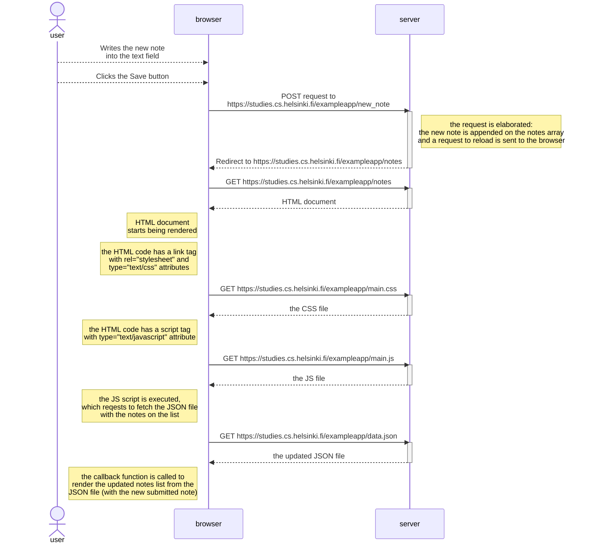

```mermaid
sequenceDiagram
actor user
participant browser
participant server

    user -->> browser: Writes the new note<br/>into the text field
    user -->> browser: Clicks the Save button

    browser ->> server: POST request to<br/> https://studies.cs.helsinki.fi/exampleapp/new_note
    activate server
    note right of server: the request is elaborated:<br/>the new note is appended  on the notes array<br/>and a request to reload is sent to the browser
    server -->> browser: Redirect to https://studies.cs.helsinki.fi/exampleapp/notes
    deactivate server

    browser ->> server: GET https://studies.cs.helsinki.fi/exampleapp/notes
    activate server
    server -->> browser: HTML document
    deactivate server
    note left of browser: HTML document<br/>starts being rendered

    note left of browser: the HTML code has a link tag<br>with rel="stylesheet" and<br> type="text/css" attributes
    browser ->> server: GET https://studies.cs.helsinki.fi/exampleapp/main.css
    activate server
    server -->> browser: the CSS file
    deactivate server

note left of browser: the HTML code has a script tag<br>with type="text/javascript" attribute
browser ->> server: GET https://studies.cs.helsinki.fi/exampleapp/main.js
activate server
server -->> browser: the JS file
deactivate server

    note left of browser: the JS script is executed,<br/>which reqests to fetch the JSON file<br/>with the notes on the list

    browser ->> server: GET https://studies.cs.helsinki.fi/exampleapp/data.json
    activate server
    server -->> browser: the updated JSON file
    deactivate server
    note left of browser: the callback function is called to<br/>render the updated notes list from the<br/> JSON file (with the new submitted note)
```
