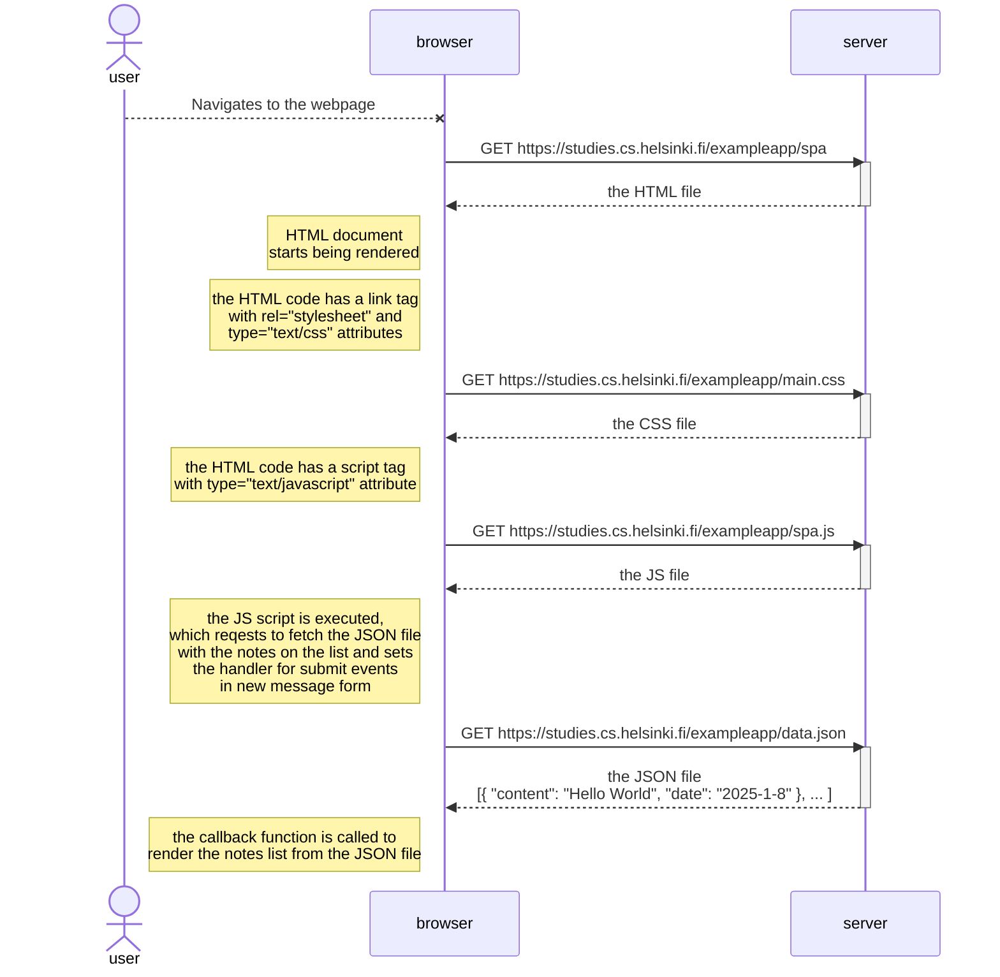

```mermaid
sequenceDiagram
    actor user
    participant browser
    participant server

    user --x browser: Navigates to the webpage

    browser ->> server: GET https://studies.cs.helsinki.fi/exampleapp/spa
    activate server
    server -->> browser: the HTML file
    deactivate server

  note left of browser: HTML document<br/>starts being rendered

    note left of browser: the HTML code has a link tag<br>with rel="stylesheet" and<br> type="text/css" attributes
    browser ->> server: GET https://studies.cs.helsinki.fi/exampleapp/main.css
    activate server
    server -->> browser: the CSS file
    deactivate server

    note left of browser: the HTML code has a script tag<br>with type="text/javascript" attribute
    browser ->> server: GET https://studies.cs.helsinki.fi/exampleapp/spa.js
    activate server
    server -->> browser: the JS file
    deactivate server

    note left of browser: the JS script is executed,<br/>which reqests to fetch the JSON file<br/>with the notes on the list and sets <br/>the handler for submit events<br/>in new message form

    browser ->> server: GET https://studies.cs.helsinki.fi/exampleapp/data.json
    activate server
    server -->> browser: the JSON file<br/>[{ "content": "Hello World", "date": "2025-1-8" }, ... ]
    deactivate server
    note left of browser: the callback function is called to<br/> render the notes list from the JSON file
```
