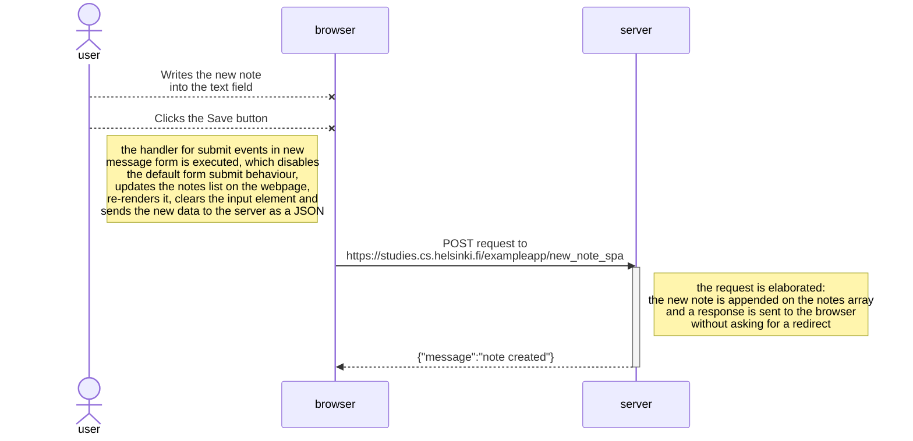

```mermaid
sequenceDiagram
actor user
participant browser
participant server

    user --x browser: Writes the new note<br/>into the text field
    user --x browser: Clicks the Save button

    note left of browser: the handler for submit events in new<br/>message form is executed, which disables <br/> the default form submit behaviour,<br/>updates the notes list on the webpage,<br/> re-renders it, clears the input element and<br/>sends the new data to the server as a JSON

    browser ->> server: POST request to<br/> https://studies.cs.helsinki.fi/exampleapp/new_note_spa

    activate server
    note right of server: the request is elaborated:<br/>the new note is appended  on the notes array<br> and a response is sent to the browser<br/>without asking for a redirect
    server -->> browser: {"message":"note created"}
    deactivate server
```
